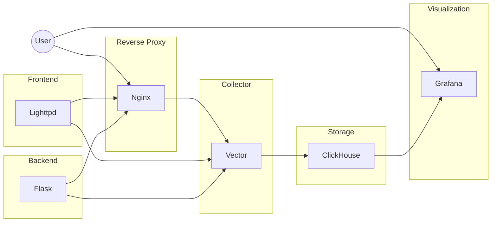

# Demonstrates docker skills as a DevOps Engineer (Modernisation)

Per assignment here -> https://github.com/tooling-automation/Future-skills

# General design overview


# Deploying
## Running
To run everything simple run the following command:
```sh
docker-compose up
```

If docker-compose is not installed or configured properly see here.
https://docs.docker.com/compose/install/

Installation instructions for docker-compose are out of scope for this documentation.

## Using

The user can access either the frontend or backend through the reverse proxy.
The frontend is hosted with lighttpd and can be accessed at https://localhost/
Please note that:
 - A file must be specified, or a 403 is thrown. https://localhost/ by itself will **not** work.
 - At this time only https://localhost/index.html works.

The backend is hosted with flask and can be accessed at https://localhost/api
Please note that:
  - At this time only https://localhost/api works.

Developers (or users, not defined in assignment) can use grafana to visualise the logging of the three containers as shown in the general design overview.

This is accessible at http://localhost:3000/. The default username and password are both `root` (can be changed in the grafana Dockerfile).

# Remarks, limitations and suggestions for upgrading

 - Only nginx logging is truly collected by vector and forwarded to clickhouse. Lighttpd and Vector logging has been configured but I'm not 100% sure if it works nor is it currently forwarded to clickhouse.
 - Clickhouse is missing database initialization for logs from Lighttpd and Flask, this must be updated in the .sql initialization file before it works (or toss it with the nginx logs, your call).
 - The .env file is only selectively used by the frontend, backend and reverse proxy and misses a lot of configurable parameters. This should be streamlined and address all containers.
 - **All containers have no persistence.** This is fine for Flask, Lighttpd, Nginx and Vector, but very bad for Grafana and Clickhouse especially. This should be addressed before truly deploying it in production.
 - Grafana initialization is not truly proper. The plugin I got to automatically install, but configuring it as a datasource is a pain and honestly not worth further pursuing for this assignment.
 - Grafana is not configured to visualize the clickhouse logs out of the box.
 - Grafana's Dockerfile has no Healthcheck configured.
 - Pipeline building only tests the frontend and backend even though all containers have a health check (except Grafana), for consistency these should  also be tested in the CI/CD pipeline.
 - Lighttpd appears to not log much or anything at all really, there's no access logs. We probably want to configure that if we have visualization.
 - Dockerfile and docker-compose.yaml do not complement eachother perfectly. Especially some Dockerfile(s) will not function when individually built as only the docker-compose properly enriches it.
 - It's a bit debatable how far we should go as (e.g.) nginx crashes quite badly if the front- and backend are not specified.

And finally some general cleanup would be nice.

Complaint:
 - Why the fuck can't we use prebuilt images, no one does that in practice. This made the assignment much much harder for no good reason (mad).